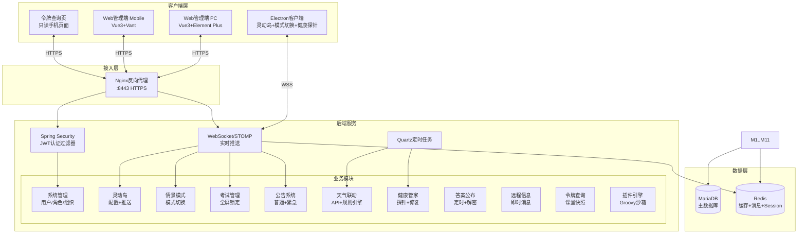

## 产品概述

灵岛校园（IslandCampus）是一套专为中小学课堂电脑设计的集群管理与教学辅助系统。采用前后端分离架构，包含后端服务、Web管理端（PC/手机响应式）、Electron客户端三个端，支持Docker Compose容器化部署。

## 核心功能模块

- **集群管理**：树状组织架构（系统-分区-学校-年级-班级-电脑），增删改查与批量导入
- **灵动岛信息栏**：屏幕顶部常驻半透明信息栏，展示日期时间、当前课程、天气、公告跑马灯、情景模式、健康状态、消息提醒；支持远程配置（样式+卡片开关+拖拽排序），WebSocket实时推送更新
- **情景模式**：上课专注（不锁屏）、课间（倒计时）、自习/测验（限制外网）、考试（全屏锁定仅显示时钟）；课程表自动切换或手动控制
- **考试管理**：新增/修改/删除考试、日历日程视图、冲突检测、手动立即开始/结束、自动联动情景模式
- **答案公布**：创建答案集（文本/图片题目+标准答案+分值），定时公布或密码解密公布，班级电脑灵动岛弹出答案卡片
- **天气联动**：通用天气API配置面板（URL/方法/请求头/Body/JSONPath解析）+ uapis.cn默认预设；可视化规则引擎（条件+动作），定时拉取
- **健康管家**：客户端探针每5分钟上报硬件（CPU温度/磁盘/内存/运行时间）和软件（可疑进程）；红黄绿灯看板、自动修复（清理临时文件/结束黑名单进程）、异常告警
- **公告系统**：普通公告（信息栏跑马灯）、紧急广播（强制弹窗+确认回执+日志）
- **远程信息**：向指定班级/年级/全校发送即时消息（右下角气泡），未读数在灵动岛角标显示
- **家长/教师令牌**：一次性或短期只读查询令牌，手机适配独立页面，查看课程表/公告/课堂快照（每15分钟截图隐私保护）
- **权限控制**：6级内置角色（超管/分区/学校/年级/班级/普通用户）+ 自定义角色，方法级权限
- **登录与安全**：JWT认证（2小时+Refresh Token）、登录失败锁定、双因素（可选）、全链路HTTPS/WSS、完整审计日志
- **开放生态**：REST API + Webhook、前端插件（Vue组件动态加载）、后端插件（Groovy沙箱/Jar包）
- **Electron客户端**：灵动岛渲染（置顶无边框透明窗口）、模式切换执行、健康探针上报、课堂截图（隐私模糊）、WebSocket连接、考试模式全屏锁定

## 技术栈选型

### 后端

| 组件 | 技术 | 版本 |
| --- | --- | --- |
| 主框架 | Spring Boot | 3.2.x |
| 语言 | Java | 17 |
| ORM | MyBatis-Plus | 3.5.x |
| 数据库 | MariaDB | 10.11+ |
| 缓存/消息 | Redis | 7.0+ |
| 定时任务 | Quartz | 2.3.x（数据库持久化） |
| 安全 | Spring Security + JWT | jjwt 0.12.x |
| API文档 | Knife4j (Swagger3) | 4.x |
| 脚本引擎 | Groovy（JSR-223沙箱） | 4.x |
| WebSocket | Spring WebSocket + STOMP | - |
| 构建工具 | Maven | - |


### Web管理端

| 组件 | 技术 |
| --- | --- |
| 框架 | Vue 3 + TypeScript |
| 构建 | Vite 5.x |
| PC UI | Element Plus |
| 移动UI | Vant 4 |
| 状态管理 | Pinia |
| HTTP | Axios |
| 实时通信 | Socket.IO-client（对接STOMP） |
| 图表 | ECharts（健康看板/考试日历） |
| 拖拽 | vuedraggable（灵动岛卡片排序） |
| 响应式 | 媒体查询切换PC/Mobile布局 |


### Electron客户端

| 组件 | 技术 |
| --- | --- |
| 框架 | Electron 28+ |
| UI | Vue 3 + TypeScript |
| 渲染 | 独立置顶无边框透明窗口 |
| 通信 | IPC + WebSocket |
| 截图 | electron-screenshot |


### 部署

| 组件 | 技术 |
| --- | --- |
| 容器化 | Docker Compose |
| 反向代理 | Nginx |
| 端口 | 8443（非标准） |
| SSL | 自签名证书 |


## 实现方案

### 高层策略

采用Monorepo结构将三个端放在同一仓库下，后端与前端共享数据库DDL和API契约。后端按Spring Boot标准分层架构（controller/service/mapper/entity/config），前端按功能模块组织。所有模块一次性搭建基础代码，核心流程端到端打通。

### 关键技术决策

1. **后端架构 - 模块化Spring Boot**：使用Maven多模块，按业务域拆分（system、island、exam、weather、announcement等），共享common模块（安全、工具类、基础实体）。每个模块独立，便于维护和扩展。

2. **权限系统 - RBAC + 数据权限**：角色-权限位掩码 + 组织树数据权限过滤。使用自定义`@DataScope`注解在MyBatis拦截器层面自动注入组织条件，避免每个查询手动过滤。JWT使用双Token机制（Access Token 2小时 + Refresh Token 7天HttpOnly Cookie）。

3. **WebSocket - STOMP协议 + Redis Pub/Sub**：Spring WebSocket + STOMP实现，消息通过Redis Pub/Sub在集群节点间广播。客户端订阅`/topic/computer/{id}`接收个性化推送。连接管理使用Redis存储Session映射。

4. **灵动岛配置 - JSON Schema + 继承覆盖**：配置存储为JSON，采用全局默认→年级覆盖→班级覆盖→电脑个性化三级继承。配置变更时通过WebSocket实时推送。

5. **考试模式 - 客户端本地锁定 + 服务端心跳监控**：客户端收到`exam_start`后创建kiosk模式全屏窗口（Electron的`win.setFullScreen(true)` + 禁用快捷键），每10秒发送心跳。服务端若60秒未收到心跳则标记异常并通知管理员。

6. **天气系统 - 策略模式 + 模板方法**：定义统一`WeatherFetcher`接口，内置`UapisWeatherFetcher`默认实现和`GenericHttpWeatherFetcher`通用实现。通用实现支持自定义URL/方法/请求头/JSONPath解析。天气数据缓存到Redis（TTL与拉取频率一致）。

7. **Groovy沙箱 - 白名单类加载 + 资源限制**：使用`GroovyShell`配合自定义`ClassLoader`限制访问范围，设置执行超时（5秒）和内存限制，通过`SecureASTCustomizer`禁用危险操作（文件IO、网络访问、反射）。

8. **前端响应式 - 双UI库共存**：通过`useDeviceDetect()`组合式函数检测设备类型，动态注册Element Plus或Vant组件。使用CSS媒体查询 + 条件组件渲染实现PC/手机两套布局。

9. **Electron灵动岛窗口 - 多窗口架构**：主进程管理3类窗口：主窗口（隐藏/最小化）、灵动岛窗口（alwaysOnTop+transparent+skipTaskbar+focusable=false）、考试锁定窗口（fullscreen+kiosk）。灵动岛使用CSS动画减少重绘，仅刷新变化区域。

### 性能与可靠性

- **缓存策略**：天气数据Redis缓存30分钟、课程表按天缓存、权限信息JWT自带减少查询、灵动岛配置变更时主动失效
- **批量操作**：电脑批量导入使用MyBatis-Plus的`saveBatch`，WebSocket群发使用Redis Pub/Sub避免单点瓶颈
- **健康探针**：客户端每5分钟上报，服务端异步处理写入；超过15分钟未上报标记为离线（黄色），超过30分钟为异常（红色）
- **截图优化**：每15分钟截图一次，仅截取屏幕上部80%区域，自动检测并模糊浏览器地址栏和聊天软件窗口，存储为低分辨率JPEG（宽度800px）

### 避免技术债务

- 所有API遵循RESTful规范，使用统一响应体`R<T>`和分页`PageResult<T>`
- 全局异常处理器统一错误码和格式
- 使用Lombok减少样板代码，MapStruct处理对象转换
- 配置外置到application.yml，敏感信息通过环境变量注入
- 数据库变更使用Flyway管理版本迁移

## 架构设计

### 系统架构



### 数据流 - 灵动岛实时更新

```
管理员修改配置 → 后端校验权限 → 存入DB(island_config) → 发布Redis消息 → 
WebSocket推送至客户端 → 客户端拉取最新配置 → 动态更新信息栏窗口
```

### 数据流 - 考试模式

```
创建/开始考试 → 后端验证+冲突检测 → 存入DB(exam) → WebSocket推送exam_start →
客户端创建全屏kiosk窗口 → 每10秒心跳 → 结束时推送exam_end → 客户端销毁窗口恢复
```

## 目录结构

```
island-campus/
├── LICENSE
├── .gitignore                              # [MODIFY] 添加Java/Node/Electron/Docker忽略规则
├── docker-compose.yml                      # [NEW] Docker编排：后端+MariaDB+Redis+Nginx+前端
├── docker/
│   ├── nginx/
│   │   ├── Dockerfile                      # [NEW] Nginx镜像
│   │   ├── nginx.conf                      # [NEW] Nginx配置（HTTPS代理）
│   │   └── ssl/                            # [NEW] SSL证书目录
│   └── scripts/
│       └── init-db.sql                     # [NEW] 数据库初始化脚本（建库+基础数据）
├── server/                                 # [NEW] Spring Boot后端根模块
│   ├── pom.xml                             # [NEW] 父POM，管理依赖版本
│   ├── sql/
│   │   └── migration/                      # [NEW] Flyway迁移脚本目录
│   │       ├── V1__init_tables.sql         # [NEW] 所有核心表DDL
│   │       └── V2__seed_data.sql           # [NEW] 初始数据（内置角色、权限、admin账号）
│   └── modules/
│       ├── common/                         # [NEW] 公共模块
│       │   ├── pom.xml
│       │   └── src/main/java/com/islandcampus/common/
│       │       ├── config/                 # Redis、WebSocket、Quartz、Groovy沙箱配置
│       │       ├── security/               # JWT过滤器、权限注解、DataScope拦截器
│       │       ├── exception/              # 全局异常处理器、业务异常、错误码枚举
│       │       ├── base/                   # BaseEntity、R统一响应、PageResult分页
│       │       ├── util/                   # 工具类（JWT工具、加密、JSONPath解析）
│       │       └── constant/               # 常量（内置角色、权限位、模式枚举）
│       ├── system/                         # [NEW] 系统管理模块
│       │   ├── pom.xml
│       │   └── src/main/java/com/islandcampus/system/
│       │       ├── controller/             # OrganizationController, UserController, RoleController
│       │       ├── service/                # 组织树CRUD、用户管理、角色权限、Excel导入
│       │       ├── mapper/                 # MyBatis-Plus Mapper
│       │       └── entity/                 # Organization, User, Role, Permission
│       ├── island/                         # [NEW] 灵动岛模块
│       │   ├── pom.xml
│       │   └── src/main/java/com/islandcampus/island/
│       │       ├── controller/             # IslandConfigController
│       │       ├── service/                # 配置管理、三级继承、WebSocket推送
│       │       └── entity/                 # IslandConfig
│       ├── mode/                           # [NEW] 情景模式模块
│       │   ├── pom.xml
│       │   └── src/main/java/com/islandcampus/mode/
│       │       ├── controller/             # SceneModeController
│       │       ├── service/                # 模式切换、课程表联动、模式调度
│       │       └── entity/                 # SceneMode, ModeSchedule, Timetable
│       ├── exam/                           # [NEW] 考试管理模块
│       │   ├── pom.xml
│       │   └── src/main/java/com/islandcampus/exam/
│       │       ├── controller/             # ExamController
│       │       ├── service/                # 考试CRUD、冲突检测、心跳监控、自动联动
│       │       └── entity/                 # Exam, ExamLog
│       ├── weather/                        # [NEW] 天气模块
│       │   ├── pom.xml
│       │   └── src/main/java/com/islandcampus/weather/
│       │       ├── controller/             # WeatherConfigController, WeatherAlertRuleController
│       │       ├── service/                # WeatherFetcher接口、Uapis实现、通用HTTP实现、规则引擎
│       │       └── entity/                 # WeatherConfig, WeatherAlertRule
│       ├── announcement/                   # [NEW] 公告模块
│       │   ├── pom.xml
│       │   └── src/main/java/com/islandcampus/announcement/
│       │       ├── controller/             # AnnouncementController
│       │       ├── service/                # 普通公告、紧急广播、确认回执
│       │       └── entity/                 # Announcement
│       ├── message/                        # [NEW] 远程信息模块
│       │   ├── pom.xml
│       │   └── src/main/java/com/islandcampus/message/
│       │       ├── controller/             # RemoteMessageController
│       │       ├── service/                # 发送消息、WebSocket推送、未读计数
│       │       └── entity/                 # RemoteMessage
│       ├── answer/                         # [NEW] 答案公布模块
│       │   ├── pom.xml
│       │   └── src/main/java/com/islandcampus/answer/
│       │       ├── controller/             # AnswerSetController
│       │       ├── service/                # 答案集CRUD、定时公布、密码解密、公布日志
│       │       └── entity/                 # AnswerSet, AnswerLog
│       ├── health/                         # [NEW] 健康管家模块
│       │   ├── pom.xml
│       │   └── src/main/java/com/islandcampus/health/
│       │       ├── controller/             # HealthDashboardController
│       │       ├── service/                # 数据上报处理、阈值比对、自动修复指令、异常告警
│       │       └── entity/                 # HealthReport
│       ├── computer/                       # [NEW] 电脑管理模块
│       │   ├── pom.xml
│       │   └── src/main/java/com/islandcampus/computer/
│       │       ├── controller/             # ComputerController
│       │       ├── service/                # 电脑CRUD、在线状态、批量导入
│       │       └── entity/                 # Computer
│       ├── token/                          # [NEW] 令牌模块
│       │   ├── pom.xml
│       │   └── src/main/java/com/islandcampus/token/
│       │       ├── controller/             # AccessTokenController, TokenPageController
│       │       ├── service/                # 令牌生成、验证、访问次数限制、课堂快照
│       │       └── entity/                 # AccessToken, Screenshot
│       ├── plugin/                         # [NEW] 插件引擎模块
│       │   ├── pom.xml
│       │   └── src/main/java/com/islandcampus/plugin/
│       │       ├── controller/             # PluginController
│       │       ├── service/                # 插件上传、加载、沙箱执行、生命周期管理
│       │       └── entity/                 # PluginInfo
│       └── app/                            # [NEW] 启动模块
│           ├── pom.xml
│           └── src/main/java/com/islandcampus/
│               └── IslandCampusApplication.java
├── web/                                    # [NEW] Web管理端
│   ├── package.json
│   ├── vite.config.ts
│   ├── tsconfig.json
│   ├── env.d.ts
│   ├── index.html
│   └── src/
│       ├── main.ts                         # 入口，初始化Pinia/Router/Axios
│       ├── App.vue                         # 根组件，设备检测+双UI库切换
│       ├── router/index.ts                 # 路由配置，路由守卫
│       ├── store/                          # Pinia Store
│       │   ├── user.ts                     # 用户信息、权限
│       │   ├── island.ts                   # 灵动岛配置预览
│       │   └── app.ts                      # 应用全局状态（主题、设备类型）
│       ├── api/                            # Axios封装
│       │   ├── request.ts                  # 拦截器（JWT+Refresh Token）
│       │   ├── auth.ts                     # 登录/登出
│       │   ├── organization.ts
│       │   ├── computer.ts
│       │   ├── island.ts
│       │   ├── mode.ts
│       │   ├── exam.ts
│       │   ├── weather.ts
│       │   ├── announcement.ts
│       │   ├── message.ts
│       │   ├── answer.ts
│       │   ├── health.ts
│       │   ├── token.ts
│       │   └── plugin.ts
│       ├── utils/                          # 工具函数
│       │   ├── device.ts                   # useDeviceDetect组合式函数
│       │   ├── permission.ts              # 按钮权限指令v-permission
│       │   └── socket.ts                  # Socket.IO/STOMP封装
│       ├── layouts/
│       │   ├── DefaultLayout.vue           # PC端布局（侧边栏+顶栏+内容区）
│       │   └── MobileLayout.vue            # 移动端布局（底部Tab栏）
│       ├── views/                          # 页面视图
│       │   ├── login/                      # 登录页
│       │   ├── dashboard/                  # 仪表盘首页
│       │   ├── system/                     # 系统管理（组织/用户/角色/权限）
│       │   ├── computer/                   # 电脑管理（列表/导入/详情）
│       │   ├── island/                     # 灵动岛配置（全局/班级覆盖/预览）
│       │   ├── timetable/                  # 课程表管理
│       │   ├── mode/                       # 情景模式（模式列表/调度计划）
│       │   ├── exam/                       # 考试管理（列表/新建/日历视图）
│       │   ├── weather/                    # 天气配置/规则引擎
│       │   ├── announcement/              # 公告管理（普通/紧急广播）
│       │   ├── message/                    # 远程信息发送
│       │   ├── answer/                     # 答案公布管理
│       │   ├── health/                     # 健康看板
│       │   ├── token/                      # 令牌生成/管理
│       │   └── plugin/                     # 插件管理
│       ├── components/                     # 公共组件
│       │   ├── OrganizationTree.vue        # 组织树选择器
│       │   ├── ComputerSelector.vue        # 电脑/班级选择器
│       │   ├── IslandPreview.vue           # 灵动岛配置实时预览
│       │   ├── ExamCalendar.vue            # 考试日历
│       │   └── HealthDashboard.vue         # 健康看板图表
│       └── styles/                         # 全局样式
│           ├── variables.scss              # SCSS变量
│           ├── pc.scss                     # PC端样式
│           └── mobile.scss                 # 移动端样式
├── client/                                 # [NEW] Electron客户端
│   ├── package.json
│   ├── electron/
│   │   ├── main.ts                         # 主进程（窗口管理、IPC、系统托盘）
│   │   ├── preload.ts                      # 预加载脚本（安全桥接）
│   │   ├── island-window.ts               # 灵动岛窗口创建与管理
│   │   ├── exam-window.ts                 # 考试锁定窗口创建与管理
│   │   ├── health-probe.ts               # 健康探针（定时采集+上报）
│   │   ├── screenshot.ts                  # 课堂截图（定时+隐私模糊）
│   │   └── websocket.ts                   # WebSocket连接管理
│   ├── src/                                # Vue3渲染层
│   │   ├── App.vue
│   │   ├── island/                         # 灵动岛UI组件
│   │   │   ├── IslandBar.vue              # 信息栏主容器
│   │   │   ├── DateTimeCard.vue           # 日期时间卡片
│   │   │   ├── CourseCard.vue             # 当前课程卡片
│   │   │   ├── WeatherCard.vue            # 天气卡片
│   │   │   ├── MarqueeCard.vue            # 公告跑马灯
│   │   │   ├── ModeCard.vue               # 情景模式标识
│   │   │   ├── HealthCard.vue             # 健康状态指示
│   │   │   └── MessageBadge.vue           # 消息提醒角标
│   │   ├── exam/                           # 考试模式UI
│   │   │   └── ExamLockView.vue           # 全屏锁定界面（数字时钟+考试中）
│   │   └── message/                        # 消息气泡
│   │       └── MessageBubble.vue          # 右下角消息气泡
│   └── tsconfig.json
└── temp/                                   # 临时文件（不入库）
    ├── api_keys.txt
    └── uapis-weather-help.md
```

## 实施注意事项

### 安全相关

- 天气API密钥(uapis.cn)通过后端环境变量`WEATHER_API_KEY`注入，不硬编码在前端
- JWT密钥通过环境变量`JWT_SECRET`注入
- Redis密码通过环境变量`REDIS_PASSWORD`注入
- MariaDB密码通过环境变量`MYSQL_ROOT_PASSWORD`注入
- Groovy沙箱必须禁用`java.io.*`、`java.net.*`、`java.lang.reflect.*`包访问

### 性能相关

- WebSocket消息使用Redis Pub/Sub广播，避免内存中维护大量连接映射
- 健康探针上报使用异步线程池处理，避免阻塞WebSocket IO线程
- 灵动岛配置变更时仅推送差异（delta），客户端增量更新
- 课程表数据按天缓存到Redis，减少DB查询
- 截图文件使用随机UUID路径+按天分目录存储，定期清理过期文件

### 兼容性

- Electron客户端仅支持Windows（课堂电脑场景），灵动岛窗口使用Windows API置顶
- Web管理端需兼容Chrome 90+、Safari 15+、Firefox 90+
- 移动端适配iOS Safari和Android Chrome

## Agent Extensions

### SubAgent

- **code-explorer**
- Purpose: 在实施阶段探索已生成的代码结构，验证模块间依赖关系和API一致性
- Expected outcome: 确保后端多模块POM依赖正确、前后端API契约一致、数据库表与实体映射正确